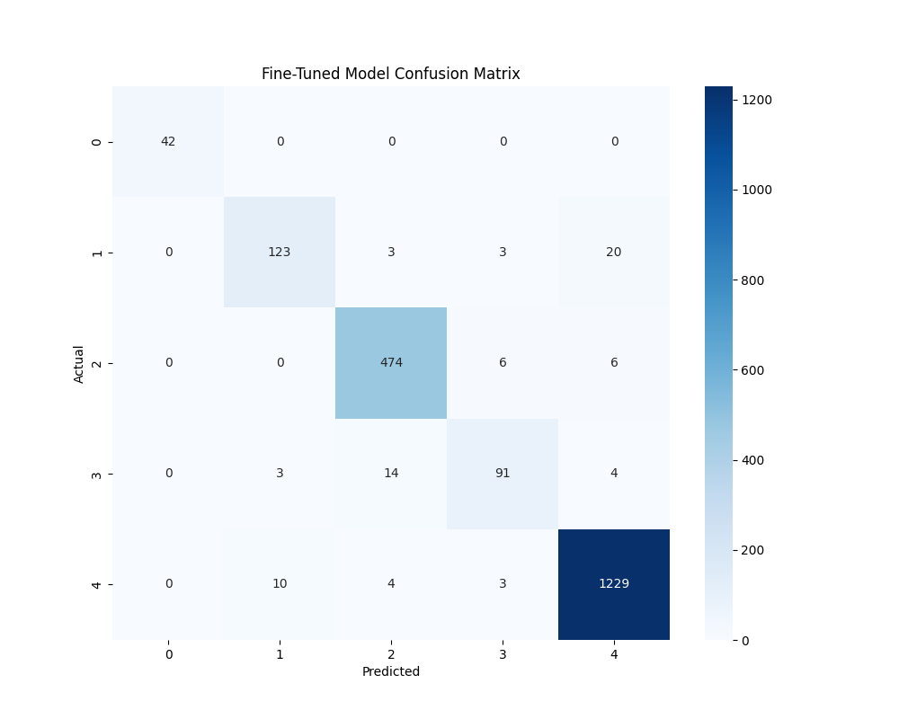
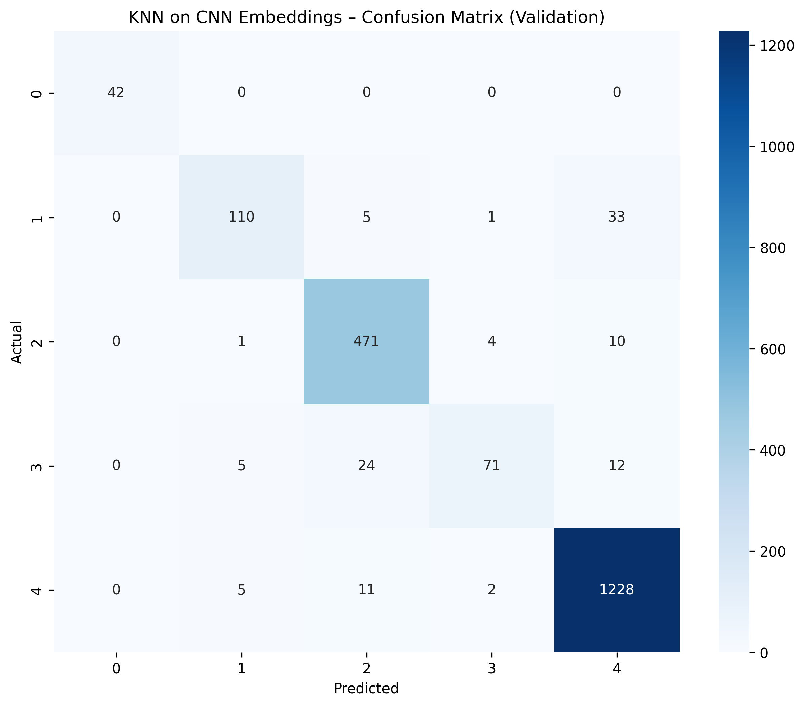

<details>
<summary><strong>Project structure</strong></summary>

wbc-cnn-knn-classifier/
├── data/
│   ├── splits/               # CSV files for train, val, and Test-A splits
│   └── vectors/              # Saved CNN embeddings (.npy files)
├── models/
│   ├── finetuned/            # Saved EfficientNetB0 Keras models after fine-tuning
│   ├── encoder/              # Extracted feature encoder model (GAP layer)
│   └── knn/                  # Saved joblib KNN pipelines
├── src/
│   └── cleaning/
├── notebooks/
│   ├── 01_Data_Setup.ipynb
│   ├── 02_preprocessing.ipynb
│   ├── 03_train_baseline_cnn.ipynb
│   ├── 04_Embeddings_extraction.ipynb
│   ├── 05_KNN_Training.ipynb
│   └── 06_CNN_VS_KNN_ON_EMBEDDINGS.ipynb
└── README.md
</details>

# WBC Classification: CNN vs. KNN on Embeddings

This project implements a comparative pipeline for classifying White Blood Cells (WBC) into five biological categories: **Basophil, Eosinophil, Lymphocyte, Monocyte, and Neutrophil**.

The repository explores whether high-dimensional features extracted from a deep learning model can be effectively classified using simple distance-based algorithms like K-Nearest Neighbors (KNN).

## Project Motivation

Automated WBC classification is critical for diagnosing infections and leukemia. While CNNs are the gold standard, this project evaluates the efficiency and accuracy of using **CNN-derived embeddings** as input for a KNN classifier, comparing the two approaches on an unseen test set (Test-A).

## Dataset

This project uses the **White Blood Cells Dataset** available on Kaggle:

https://www.kaggle.com/datasets/masoudnickparvar/white-blood-cells-dataset

The dataset consists of microscopy images of white blood cells labeled into five biological categories:
- Basophil
- Eosinophil
- Lymphocyte
- Monocyte
- Neutrophil

### Dataset Characteristics
- RGB microscopy images
- Images organized by class folders
- Moderate class imbalance across cell types
- Suitable for multi-class image classification

The original dataset is split into predefined subsets.  
In this project:
- The raw images are downloaded using **KaggleHub**
- Custom **CSV split files** are generated to define:
  - training set
  - validation set
  - Test-A set (held-out evaluation)

The dataset itself is **not included** in the repository and must be downloaded separately.


### Example response

```json
{
  "predicted_class": "Neutrophil",
  "confidence": 0.9722,
  "top_k": [
    { "class": "Neutrophil", "prob": 0.9722 },
    { "class": "Monocyte", "prob": 0.0185 },
    { "class": "Lymphocyte", "prob": 0.0053 },
    { "class": "Eosinophil", "prob": 0.0031 },
    { "class": "Basophil", "prob": 0.0009 }
  ],
  "inference_time_ms": 142.5
}
```


### Performance Summary

| Model | Accuracy (Test-A) | Macro F1-Score |
| :--- | :--- | :--- |
| **CNN (EfficientNetB0)** | **0.96** | **0.93** |
| **KNN (on Embeddings)** | **0.95** | **0.91** |

*Key Finding: The KNN classifier achieves near-parity with the full CNN head when using Cosine similarity on the global average pooling features.*

## Confusion Matrices

The confusion matrices below illustrate class-level performance on the **Test-A** set.

### CNN (EfficientNetB0)
<p align="center">
  
</p>

### KNN on CNN Embeddings
<p align="center">
  
</p>

These matrices highlight common confusions between morphologically similar white blood cell types and complement the aggregate performance metrics reported above.


## Installation and Usage
```bash
pip install tensorflow pandas numpy scikit-learn matplotlib seaborn joblib kagglehub
```

## Pipeline Execution

The project is organized as a sequential, notebook-based pipeline.

### 1. Data Setup & Preprocessing

- **01_Data_Setup.ipynb**  
  Downloads the white blood cell image dataset using **KaggleHub** and generates randomized (avoid any ordering bias) CSV splits for:
  - training
  - validation
  - Test-A set

- **02_preprocessing.ipynb**  
  Constructs a TensorFlow `tf.data` pipeline for efficient image loading, including:
  - resizing to **224 × 224**
  - batching and shuffling


---

### 2. CNN Training

- **03_train_baseline_cnn.ipynb**  
  Fine-tunes a **pretrained EfficientNetB0** model using data augmentation and a two-phase training strategy:

  **Data augmentation**
  - Random transformations applied to training images
  - Helps improve generalization and reduce overfitting

  **Phase 1**
  - Backbone frozen
  - Custom classification head trained
  - Learning rate: **1e-3**

  **Phase 2**
  - Top **20 layers** of the backbone unfrozen
  - Fine-tuning with a lower learning rate
  - Learning rate: **1e-5**


---

### 3. Feature Engineering

- **04_Embeddings_extraction.ipynb**  
  Uses the fine-tuned CNN as a feature extractor.
  
  - Embeddings are taken from the **GlobalAveragePooling2D** layer
  - Each image is represented as a **1,280-dimensional feature vector**
  - Features are saved as `.npy` files for efficient reuse

---

### 4. Hybrid KNN Classifier

- **05_KNN_Training.ipynb**  
  Trains and optimizes a **K-Nearest Neighbors** classifier on CNN embeddings.

  - Hyperparameters are selected via grid search
  - Best configuration:
    - `k = 9`
    - distance metric: **cosine**
    - no PCA dimensionality reduction

  The final KNN model is serialized using **joblib**.

---

### 5. Final Comparison

- **06_CNN_VS_KNN_ON_EMBEDDINGS.ipynb**  
  Performs the final evaluation and comparison between:
  - the CNN’s **Softmax** predictions
  - the KNN’s **distance-based** predictions on embeddings

  The notebook generates:
  - confusion matrices
  - classification reports

  This allows a direct comparison between end-to-end deep learning and hybrid deep + classical approaches.

